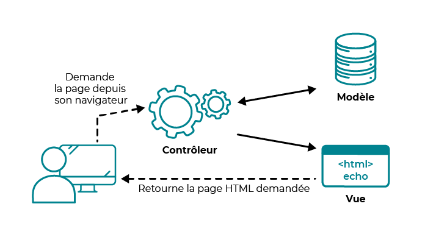

# 🚀 The Blogs sur les langages
## 📝 Le MVC : description
>Les design patterns – ou patrons de conception – sont des méthodes de codage reconnues, qui permettent de résoudre des problèmes récurrents. MVC signifie “Modèle, Vue, Contrôleur”, c’est un patron de conception concernant l'agencement du code. Le code est segmenté selon ces trois sections : le modèle contient le code qui gère la logique métier, la vue celui qui gère l'affichage, et le contrôleur gère le lien avec l'utilisateur.

> Exemple visuel


## ⚡️ Langage de développement: PHP version 8.0
## 📝 Déployement local
>Pour visualiser ou tester mon projet il faut avoir installé l'environnement suivant:
1. Xamp ou Mamp ou wamp ou Lamp
2. Importer la bdd qui se trouve dans le répertoire bdd de mon projet
3. Démarrer le server local: Apache & mySQL
4. Accèder eu repertoire localhost: ```php htdoc/ projet_php```
5. Ajouter sur la barre d'adresse du navigateur l'URL : *http://localhost/7-mvc-2324/* 

[](https://forthebadge.com)